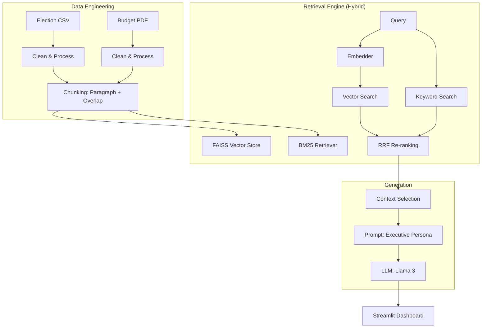

# System Architecture & Design Design

## 1. Overview
The Civic Scribe is a high-fidelity RAG (Retrieval-Augmented Generation) system built for the Executive Branch of Ghana. It utilizes a custom-built pipeline (no high-level frameworks like LangChain) to provide authoritative briefings on national archives.

## 2. Architecture Diagram

## 3. Data Flow
1. **Ingestion:** Raw PDF and CSV data is cleaned of noise (headers/footers/nulls).
2. **Indexing:** Data is chunked using a semantic paragraph strategy and indexed in FAISS (Vector) and BM25 (Keyword).
3. **Retrieval:** A user query triggers a parallel search. The results are combined using **Reciprocal Rank Fusion (RRF)** to ensure high-accuracy document ranking.
4. **Augmentation:** The top 4 retrieved chunks are injected into a strict system prompt.
5. **Generation:** The LLM generates a text-only briefing report in a formal "Executive Scribe" persona.

## 4. Design Justification
- **Why Hybrid Retrieval?** Budget documents (PDF) are best found via semantic vector search, while specific Election statistics (CSV) often require exact keyword matching. Hybrid search ensures both are retrieved accurately.
- **Why RRF?** RRF provides a robust way to combine different retrieval signals without needing to manually tune weight parameters.
- **Why Streamlit?** Provides a clean, responsive UI for executive-level interaction.
