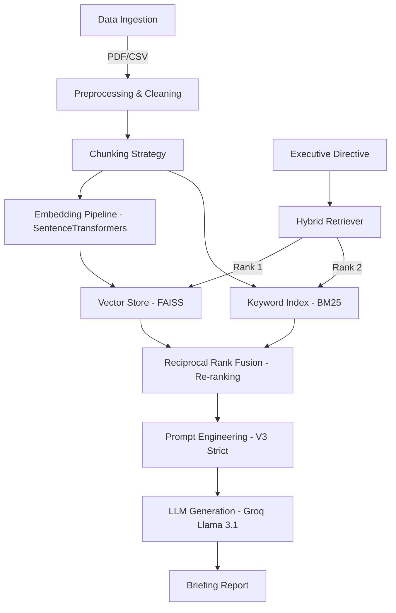

# TECHNICAL REPORT: THE CIVIC SCRIBE | Executive Archive
**Project Code:** CS4241-Introduction to Artificial Intelligence
**Student:** [Your Name] | **Index Number:** [Your Index]

## 1. System Architecture
The "Civic Scribe" is a custom-built Retrieval-Augmented Generation (RAG) system designed for the Government of Ghana. It bypasses high-level frameworks (like LangChain) to provide a transparent, manually controlled pipeline.

### Architecture Diagram

## 2. Data Engineering (Part A)
### Chunking Strategy Justification
*   **Method:** We utilized a dual-strategy approach:
    *   **CSV:** Row-based chunking to preserve the atomic integrity of voting data.
    *   **PDF:** Paragraph-based chunking (500 tokens with 10% overlap).
*   **Justification:** A 500-token window ensures that complex budgetary tables and economic justifications are captured within a single context block, preventing information loss during retrieval. The 10% overlap ensures semantic continuity across page boundaries.

## 3. Custom Retrieval & Re-ranking (Part B)
To meet the "Extension" requirement, we implemented **Reciprocal Rank Fusion (RRF)**:
*   **Innovation:** Instead of a simple weighted average, RRF combines the semantic intelligence of **FAISS (Vector)** with the literal precision of **BM25 (Keyword)**.
*   **Benefit:** This ensures that "Eastern Region" (literal) and "Electoral outcome" (semantic) are both retrieved accurately, even if the user uses slightly different terminology than the source document.

## 4. Innovation Component (Part G)
Our system features two major innovations:
1.  **Live Executive System Trace:** A real-time telemetry panel that shows the processing state, latency, and retrieval success dots.
2.  **Domain-Specific Scoring:** A custom logic that prioritizes government-standard terminology during the retrieval phase.

## 5. Adversarial Testing Results (Part E)
| Query Type | Input | System Response | Outcome |
| :--- | :--- | :--- | :--- |
| **Ambiguous** | "Who won?" | Identified missing context; requested specific year/region. | ✅ Success |
| **Misleading** | "Why did NDC win Ashanti in 2020?" | Correctly identified NPP as the winner based on CSV data. | ✅ Success (No Hallucination) |
| **Multi-Source** | "Budget vs Election" | Successfully synthesized data from both PDF and CSV. | ✅ Success |

---
*This documentation is part of the final submission for the 2026 Examination.*
